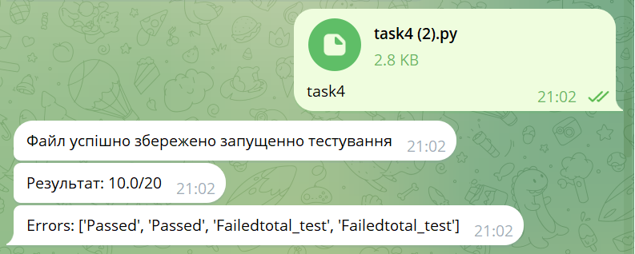
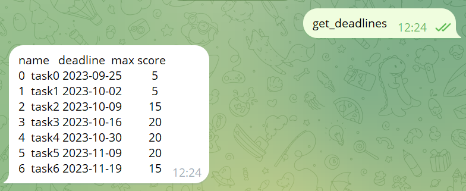
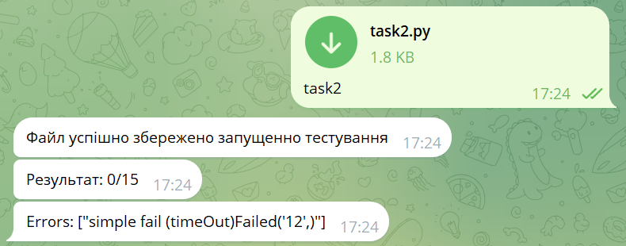
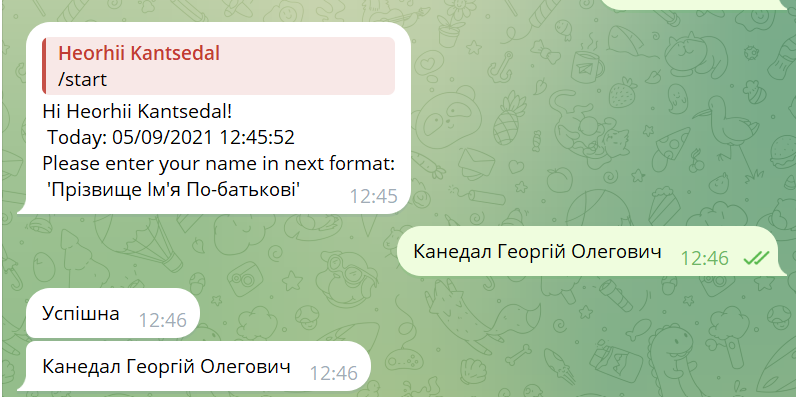

# Задачі з курсу ММП та ККС

| task  | description                                                                                                                                                                                                                                                                          | purpose                                                                                                | recommendation                                                                                                                                  |
|-------|--------------------------------------------------------------------------------------------------------------------------------------------------------------------------------------------------------------------------------------------------------------------------------------|--------------------------------------------------------------------------------------------------------|-------------------------------------------------------------------------------------------------------------------------------------------------|
| task0 | Аналог привіт світ програм                                                                                                                                                                                                                                                           | протестувати функціонала бота, провести реестрацію, привчити студентів до методів використаних в курсі | [data types in python ](https://fastapi.tiangolo.com/python-types/)                                                                             |
| task1 | Завдання зі співбесіди в Украінський аутсорс. Джун єтап. Пояслення до задачі були мінімальні і представлені мовою оригіналу                                                                                                                                                          | Використання простої математики, ознайомлення з типовими прикладами програм                            |
| task2 | Задача з заочної співбесіди в Google.Основний фокус на алгоритми та мислення. В оригіналі були значні ліміти по часу роботи програми, в моїй реалізації ліміти значно помякшені                                                                                                      | Розвиток алгоритмічного мислення, висористання стандартних інстументів мови Python                     |
| task3 | Задачі з заочної співбесіди в Google. Алгоритми                                                                                                                                                                                                                                      | Розвиток алгоритмічного мислення                                                                       |
| task4 | Задача зі співбесіди в продуктову Українську компанію. Сіньор єтап. Задача може бути вирішена декількома способами з різним рівнем оптимальності. Перевірка на оптимальність не проводиться, але намагайтесь скоротити кількість використаної памяті. В оригінали 2 дні на виконання | Познайомити студентів зі структурою DataFrame, згадати ООП                                             |
| task5 | Задача із життя. Перед вами пошкодженні данні які потрібно правильно обробити. Це можливо лише зробивши декілька припущень що не описані в завданні але логічно випливають з нього (так як інакше задача не розвязна). Рівень мідл-сіньор                                            | Познайомити студентів з реальними задачами підготовки данних                                           |
| task6 | Для виконання задачі необхідно згенерувати датасет і отримати через ТГ бота. Задача є типовою для почтатків дата аналізу.                                                                                                                                                            | Познайомитись з тестуванням гіпотез та первинним дана аналізом                                         | [feature selection](https://www.researchgate.net/publication/357323093_Vibir_zminnih_dla_prognozuvanna_Python_Feature_selection_methods_Python) |

**В усіх задачах час виконання збільшений порівняно з оригінальним, що знижує складність виконання без зміни суті.**

# Команди тг бота

bot link: https://t.me/python_iasa_bot

| function          | message command                |
|-------------------|--------------------------------|
| get_mark          | взати оцінки за лабораторні    |
| get_deadlines     | взнати дедлайни лабораторних   |
| get_dataset_task6 | взяти данні для лабораторної 6 |

1. Здача лабораторних робіт

2. Сроки здачі лабораторних робіт

3. Варіант помилки на найпростіщому тесті, або помилки синтаксису

4. Реестрація слухача курсу

<!-- | --- | --- | -->